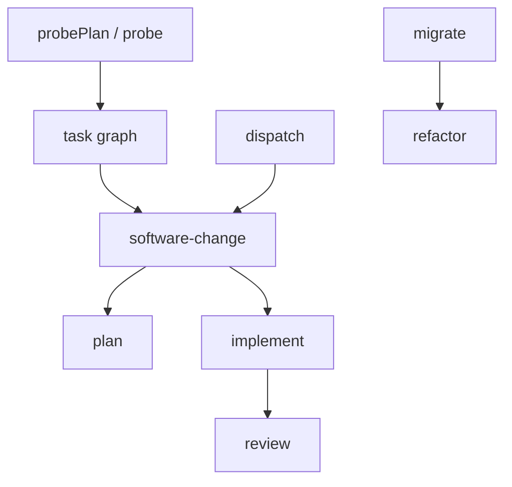

# Architecture

**Agent workflows you can read, reason about, and verify.**

Build composable agent workflows in ordinary TypeScript, with explicit control flow, typed state, and deterministic verification.

Sigil is a TypeScript workflow system organized around cohesive feature modules inside one package. The public command surface is `task-graph`, `migrate`, `refactor`, `probe`, `plan`, `software-change`, `implement`, `review`, `breakdown`, `dispatch`, `profile`, `config`, `validate-workflow`, `validate-sigil`, `run-workflow`, `run-sigil`, `setup`, and `discover-env`. `src/cli.ts` is intentionally thin: it selects the command, routes global and per-command help, and maps top-level usage or unhandled errors to process exit codes. It delegates all command-specific work to the command registry in `src/commands/index.ts`.

`src/commands/` is the CLI adapter layer. Command modules parse flags, load files named by flags, call typed workflow or service functions, format safe human or versioned JSON output, and map command results to exit codes. The adapters do not own workflow state transitions. `src/commands/task-graph.ts` exposes schema and validation for assistant-authored and agentically produced task graphs. `src/commands/profile.ts` adapts provider-neutral profile operations while provider-owned stores retain routing state. `src/commands/software-change.ts` adapts `plan`, `software-change`, `implement`, and `review`. `src/commands/repository-programs.ts` adapts `probe`, `refactor`, `migrate`, `breakdown`, and `dispatch`. `validation.ts`, `run.ts`, `setup.ts`, and `environment.ts` own their narrower command surfaces.

`src/index.ts` is the server-side TypeScript entrypoint. It exports the authoring surface, provider-neutral configuration, built-in workflow callables, and YAML compilation and execution. `src/contracts-entry.ts` is the pure `sigil/contracts` entrypoint for backlog, task-graph, and YAML schemas, types, parsing, and validation. `src/server-entry.ts` is the Node-compatible `sigil/server` entrypoint for running an already imported workflow with application-owned identity, external artifact storage, cancellation, and awaited events. Provider constructors, Git delivery effects, process internals, prompt bindings, source-runner operations, and application queue or authorization adapters are not package exports. Public library calls are plain async functions with typed inputs and typed results. They are not represented as CLI commands internally, and they are not workflow DSL nodes.

Each workflow runs with a `SigilContext` for its target repository. The context owns agent lifecycles, nested workflow calls, parallel operations, configured eval gates, deterministic shell commands, issue recording, and artifact helpers. `ctx.run` passes the active context to a nested workflow, so the parent and child share one artifact root. A caller uses `ctx.fork` when a child operation needs its own artifact namespace and a live operation path mirrored into the parent runtime status.

## Runtime terminology

Sigil is the product and workflow runtime. A workflow coordinates operations and owns a state transition. A TypeScript Sigil is a workflow implemented with the `sigil()` API; a YAML workflow is the declarative surface for a fixed topology. An operation is one bounded prompt, gate, script, artifact write, nested workflow call, or external effect. It is conceptual architecture vocabulary rather than a required first-class runtime object.

An LLM supplies reasoning and generation. An agent runtime supplies tools, permissions, and session continuity. An agent role such as `reviewer` resolves through configuration to an agent binding containing the runtime/provider, model, and reasoning effort. `ctx.agent(...)` creates a live agent session from that binding. See [LLMs, agent runtimes, agents, and workflows](./docs/explanation/llms-agents-and-workflows.md) for the complete glossary.

Users, callers, or configured policy grant authority for repository and external effects. Deterministic code enforces those boundaries and owns persistence, gates, checkpoints, and effect execution. Agents supply bounded judgment inside workflow operations.

## Development entry paths

AI-assisted development and agentic development describe ownership of the transition into the task graph. They are not runtime modes, provider modes, or configuration values.

In AI-assisted development, the developer's current code assistant owns the agreed requirements or Markdown plan, verifies concrete repository claims, authors the task graph, and validates it. In agentic development, `plan`, `probePlan`, or `softwareChange` owns the transition from intent or brief to the same validated task graph. `implement` consumes either graph through the same implementation workflow.

The existence of a Markdown plan does not select agentic planning. The current assistant translates an active plan directly into a task graph by default. `software-change --brief` is the explicit path when the developer asks Sigil to plan or replan.

## Workflow readability

TypeScript owns sequencing, branching, iteration, concurrency, state transitions, and failure propagation. Agents inspect, propose, decide, create, critique, and repair inside those boundaries. An agent loop is ordinary program control around one or more nondeterministic operations; the loop itself is not an agent abstraction.

A workflow body should read top to bottom as its plain-language description. Each conceptual step should appear as one named statement in the same order. Cross-step state travels through typed returns. Prompts and bindings stay outside maintained workflow bodies. Resource lifecycle stays scoped to the operation that owns it. Repeated checkpoint serialization, schema parsing, retry counters, and issue accumulation belong behind the producing or policy-owning operation rather than interrupting every call site.

This rule does not require TypeScript to look declarative or hide meaningful behavior. Ordinary `if`, `for`, `while`, and function calls are the clearest representation of dynamic control flow. Consequential state transitions, stop conditions, verification decisions, and authority-bearing effects remain visible even when their plumbing is encapsulated.

YAML and TypeScript share the same workflow concepts. A concept that takes one readable line in a static YAML workflow should take approximately one readable line in TypeScript. YAML is appropriate when topology is fixed; TypeScript is appropriate when runtime evidence changes the work, branch count, agent choice, iteration, or child workflow selection.

## Ownership and dependency direction

Feature modules own workflow behavior under `src/workflows/<feature>/`. A module owns its prompt templates, stage helpers, result shape, state transition, and Mermaid diagram when the workflow is complex enough to need one. Prompt text lives beside the feature module in template files, reached through a small `prompts.ts` binding. The package build copies only registered prompt templates and dashboard static files into the staged `resources/` tree, records their digests, and excludes workflow diagrams from runtime resources. Provider/model bindings, eval gate names, shell commands, planner and reviewer roles, branch policy, and coder-session policy live in `sigil.config.json` and `src/config.ts`. Code bodies name which prompt or configured binding they use; they do not inline prompt text, model names, or shell commands.

Shared modules exist only for contracts and runtime primitives that are genuinely shared. `src/contracts/` owns the backlog and task-graph contracts because multiple workflows read or write those handoff formats. `src/agent.ts` owns the provider-neutral agent contract, schema wrappers, and lazy session lifecycle. `src/agents.ts` resolves validated bindings synchronously, while `src/providers/` dynamically loads the selected provider adapter on first use. `src/context.ts`, `src/provider-failure.ts`, `src/owned-process.ts`, `src/process-lifecycle.ts`, `src/process-group.ts`, `src/owned-pty-process.ts`, `src/claude-pty.ts`, `src/gate.ts`, `src/git.ts`, `src/paths.ts`, `src/prompts.ts`, `src/recovery/`, `src/verification.ts`, `src/workspace.ts`, `src/yaml/`, and `src/reports/` are root-level primitives because they serve more than one feature boundary. `process-lifecycle.ts` defines process start and stop notifications, `process-group.ts` owns identity-checked group termination, and `owned-pty-process.ts` binds PTY IO to that lifecycle and guarantees group cleanup. `claude-pty.ts` owns Claude session identity, executable and child-environment selection, per-turn PTY creation, transcript matching, and provider failure classification. Feature-local helpers stay inside the feature module.

Dependency direction is one-way at workflow boundaries. Command adapters depend on workflow modules. `software-change` composes planning and implementation, and implementation invokes the same review stage used by the standalone review command. `dispatch` may call `softwareChange`, but `software-change` does not depend on dispatch or delivery policy. `migrate` may call `refactor`; `refactor` remains a separate workflow because it owns bounded structural repair and review convergence for one repository slice.

## Composable workflow boundaries

Built-in workflows remain independently callable and compose through typed handoffs:

| Workflow | Owned transition |
| --- | --- |
| `plan` | Change intent to a validated task graph or typed planning failure. |
| `probePlan` | Uncertain change intent to an evidence-backed task graph or typed probe failure through sandboxed experiments. The CLI adapter is `probe`. |
| `implement` | Accepted task graph to implemented, verified, and reviewed local branch state. CLI publication requires explicit authority. |
| `review` | Existing diff to a reviewed and optionally repaired result. |
| `softwareChange` | Intent or accepted task graph to one verified branch change or a typed stopped result. |
| `breakdown` | Mission to a validated dependency-ordered backlog. |
| `dispatch` | Accepted backlog to checkpointed delivery progress and, when complete, delivered changes. |
| `refactor` | Structural intent to one verified structural transformation. |
| `migrate` | Repository target and backlog to checkpointed repository-wide convergence. |

The routing invariant follows from those ownership boundaries: reuse accepted artifacts and verified state, then invoke the narrowest workflow that owns the unfinished transition.

## Single-change workflow

`softwareChange` is the primary agentic single-change workflow. It requires configured implementation verification before starting planners, then composes planning, implementation, verification/review, and evidence construction and returns a branch and PR body without publishing. It has two entry forms. With normal intent input, it calls `plan`, receives a typed task graph, and passes that graph to `implement`. With `taskFile`, it validates an existing typed task graph and starts at implementation. In both forms the workflow returns combined evidence and does not push, open a pull request, merge, or apply a dispatch policy.

`plan`, `implement`, and `review` remain independently callable stages. They use the same stage modules as the unified workflow, so the command surface and library surface share behavior instead of maintaining duplicate paths. `plan` loads repository context, runs configured planners independently in parallel, compares their requirement coverage, verifies repository claims, resolves architecture and interface disagreements, writes and enriches the task graph, and applies deterministic validation. The synthesizer owns the complete planning result and returns the validated graph directly. `implement` canonically persists the validated graph, atomically checkpoints baseline evidence plus task and Git identity, and advances a deterministic dependency-aware serial frontier. Resume restores the original baseline evidence rather than treating the completed-task frontier as a new baseline. One coder session handles consecutive tasks until rotation or invalidation. Its first task carries graph context, freshly loaded configured context, and any checkpoint handoff; later turns carry only the next task contract. A replacement or resumed coder initializes from current repository and checkpoint state. Retryable failures may repeat a turn within its bounded coder session, while capacity rerouting first returns control to implementation so the current work can be preserved and the session invalidated. After each coder turn, implementation runs the task graph's command verification before repository-wide task gates. Provider interruptions preserve restorable tracked and untracked work for verified resume; final verification and review run only after every task has a verified commit. Final gate results carry repository-state, gate-plan, and runtime-environment receipts. An unchanged review reuses the preceding result, and a review repair returns its successful verification to the implementation owner rather than running the same gates again. Verified changes are committed through repository hooks, and a hook failure remains a failed commit. `review` diffs a base ref against HEAD, runs configured correctness reviewers independently, preserves their reports, synthesizes distinct supported findings, optionally fixes actionable findings, and uses the configured review synthesizer to check test diffs for weakened tests.

The task graph is the public typed contract between accepted planning context and implementation. `src/contracts/task-graph.ts` owns its structural schema, JSON Schema projection, normalization, repo-relative path checks, semantic digest, deterministic dependency ordering, cycle detection, and produced and consumed interface validation. A code assistant, `plan`, or `probePlan` may produce the contract; deterministic validation accepts it, and implementation refuses invalid graphs. The graph preserves goal, architecture, constraints, non-goals, task interfaces, observable acceptance, and focused verification. Produced interfaces and acceptance are authoritative implementation boundaries. File lists and mechanisms remain evidence-backed planning guidance.

## Repository-program workflows

`breakdown`, `dispatch`, `probe`, `refactor`, and `migrate` are separate from `software-change` because each owns a different state transition.

`breakdown` turns a mission into a backlog contract. It runs configured planners in parallel, synthesizes a dependency-ordered backlog, enriches item briefs, validates and repairs backlog JSON, and writes the backlog artifact. The backlog contract lives in `src/contracts/backlog.ts` because `breakdown` produces it and `dispatch` consumes it.

`dispatch` consumes a backlog and applies delivery policy across backlog items. Before planning, dispatch identity-checks unfinished provider reservation ownership. It settles reservations only for owners proven dead and blocks live or unverifiable owners. Completed reconciliation is reused on resume, while profile priming remains a separate explicit operator action. For each deliverable item it calls the public `softwareChange` workflow API from the refreshed remote delivery base. Actionable review findings, including weakened tests, enter a bounded repair loop on the existing item branch. Every repair runs the configured gates. The review configuration controls how many fresh independent reviews may follow repairs and defaults to none. Dispatch then idempotently publishes the item PR, waits for required checks and merge completion, fetches the updated remote delivery base, and verifies that synchronized base before continuing.

Dispatch atomically checkpoints the backlog identity, delivery policy, delivered commits, active item, branch, canonical implementation artifacts, and operation lifecycle beneath the run artifact root. Resume first owns the run lock and proves dispatcher and child identities. A live dispatcher remains authoritative, while an abandoned child lease owns its recorded process group even after the leader exits. Reconciliation sends `SIGTERM`, escalates to `SIGKILL` after a bounded grace period, confirms that no live group members remain, and only then removes the lease. Resume then reconciles exact Git and implementation checkpoint identity before continuing the precise task. Capacity-blocked operations remain durably retryable without spending task or repair accounting; provider interruptions resume implementation checkpoints, while deterministic gate and review defects alone enter repair. Publish, merge, base verification, final integration pull request, final merge, and production verification retain canonical input plus observed remote or gate evidence, so matching effects resume without replay and changed stages invalidate only downstream delivery work. A checkpoint cannot be reused with a different backlog or delivery base. `mergeWhenGreen` delivers directly to the configured main branch. `integrationBranch` creates or resumes a named integration branch and accumulates every verified item there. Its final action can stop at one final PR to main or wait for that PR to merge and run a configured production gate. This keeps delivery policy out of `software-change` while allowing dispatch to reuse the single-change implementation path.

`probe` is a planning aid that owns sandboxed investigation before implementation. It clones a sandbox outside the target worktree, runs bounded probe commands there, preserves the target tree, writes evidence and findings artifacts, and produces the same typed task graph contract that `implement` consumes.

`refactor` owns one bounded, behavior-preserving structural change. It requires a clean target tree, establishes baseline gates, analyzes structure and risk, applies planned slices with protected-path checks, runs configured gates with bounded repair, then converges independent structure and behavior reviews. Focus paths are advisory starting points, not allowlists; protected paths are hard boundaries.

`migrate` owns repository migration checkpoints. It reads a caller-owned target and backlog from a durable external run directory, reconciles resumable checkpoint state, and runs dependency-ordered refactor items in item-owned attempt directories. The CLI rejects migration repositories, inputs, and run directories beneath operating-system temporary storage. A failed attempt preserves its diff and evidence before restoring the dedicated worktree to the preceding verified checkpoint. A verified attempt writes a pending checkpoint journal, commits the item, records the completed checkpoint, and advances state. After item completion, repository-wide build, test, architecture review, and behavior review converge through local repair histories, protected-path enforcement, and checkpointed final repairs.

## Run data, artifacts, and repository boundaries

Repository-managed top-level workflow invocations own an artifact root beneath the repository's ignored `.sigil/runs/` directory. The `sigil/server` API instead requires an isolated absolute external root and does not write repository ignore files, CLI event logs, or detached status files. Nested workflows invoked through `ctx.run` inherit the same context and artifact root. Explicitly forked operations create child namespaces beneath that root and retain its storage ownership. Dispatch gives each backlog item its own `dispatch/<item>/` namespace and runs `softwareChange` inside that item context. Explicit ephemeral persistence permits disposable temporary storage. Context-owned artifact writes go through `ctx.artifacts.path(name)`, which applies the shared path escape check. Workflows that receive a caller-owned run directory, such as `migrate`, keep mutable state, events, snapshots, and final review artifacts beneath that directory.

A workflow result is the typed value returned to its caller. An artifact is a named file output or piece of evidence owned by the workflow context. Checkpoint state is mutable resumable progress owned by workflows such as dispatch and migrate. Context `status.json` records the latest observed workflow event. A detached `run-sigil` worker adds launcher status, logs, result, and error files around the workflow run. These files have different ownership and should not be treated as interchangeable.

A workflow edits tracked project files only when that workflow explicitly owns repository edits. `plan`, `breakdown`, and normal artifact writes produce ignored run artifacts. `probe` may mutate its sandbox but must preserve the target tree. `implement` owns target edits for task execution, review fixes, and gate repairs on its implementation branch. `refactor` owns target edits for its bounded slice and review repairs. `migrate` owns target edits by delegating each backlog item to `refactor` and by committing verified item and final repair checkpoints.

Configured context is repo-relative and validated before rendering. Implementation reloads it when a coder session opens, so rotated and resumed coders receive current contents without repeating the block on every task. Context entries marked `update: false` are read-only orientation unless a task explicitly declares them as outputs. Entries marked `update: true` may be updated in place only when the implementation makes their statements false. That rule keeps context files synchronized without turning them into changelogs.

## Configuration, agents, and gates

`sigil.config.json` is the single project configuration source. Setup resolves the Git root and conservatively derives evals only from exact package scripts with an unambiguous package manager; it reports but does not execute those commands. `resolveConfig()` searches upward from the target repo, retains raw project input and leaf provenance, applies command overlays over project values and schema defaults, validates the config shape, and rejects references to unknown agents. `loadConfig()` remains its value-only projection for workflow callers. The config owns agent routing, eval commands and their explicit coverage relationships, optional workspace bootstrap and readiness commands, context files, planner and synthesizer names, implement coder, repair limit, per-attempt total and idle timeouts, cancellation grace, branch prefix, base branch, optional test report settings, and review panel and synthesizer. A timed-out attempt requests provider cancellation and observes settlement for the configured grace period. A settled attempt may route a retry only after cleanup; an unsettled attempt returns the classified timeout without starting overlapping work, while its eventual rejection remains observed. Implementation and refactor workflows serialize workspace preparation by canonical checkout, evaluate readiness under that lock, and require bootstrap to leave tracked repository files unchanged before baseline gates.

Agents are provider/model bindings. `agent(name | binding, { cwd })` and `ctx.agent(name | binding)` synchronously validate either a configured name or inline binding and return a lazy `SigilAgent`. The first operation dynamically loads only the selected provider adapter and caches one underlying session; closing an unused agent does not initialize a provider. Configured bindings default to medium reasoning effort. The public `claude` provider has Agent SDK and local CLI PTY transports; transport selection is an adapter concern rather than a second provider literal. A Claude PTY agent owns one resumable session identity and starts one owned PTY process per turn. The process lifecycle publishes the child identity while active and clears it only after stop; the transcript is authoritative for prompt and completed-response matching, while terminal activity emits payload-free provider progress. Recovery owns total and idle deadlines. Cancellation closes the PTY, terminates its identity-checked process group, and settles lifecycle cleanup before retry or rerouting may start. Startup, authentication, invalid-option, early-exit, empty-response, and transcript-settlement failures are classified at the provider boundary.

Codex routing admits only explicit profiles through a locked transaction that combines fresh subscription evidence, active reservations, reserve floors, circuits, and metered policy; blocked capacity and invalid configuration do not start ACP. Active subscription assignments observe capacity on a bounded cadence. Reaching the configured floor opens the capacity circuit before requesting cancellation, and cleanup releases the reservation before failover can assign another operation. Re-entry requires a fresh above-floor observation and explicit rearm when the profile policy requires it. Capacity telemetry records only the profile name, capacity class, configured floor, admission outcome, and whether capacity triggered cancellation. `discover-env` reports prerequisite availability for each configured role and candidate transport without changing workflow state; executable, adapter, configuration-directory, and credential-source availability do not establish authentication.

Gates are named shell commands from config. `evalGate(name)` resolves a configured command, skips absent gates, and runs present commands under the target repo. Structured eval definitions may declare that one gate covers other configured gates. Implementation runs accepted task-graph command verification and build/test gates around each task, then stronger configured gates at the end. Refactor and migrate use deterministic configured gates as workflow checks.

## Diagrams and documentation expectations

Complex workflows keep Mermaid diagrams checked in beside their feature modules. The diagrams are reference documentation for stage ownership, state transitions, artifact boundaries, gate boundaries, failure paths, and intended parallelism. They should align with the code at the module boundary: `software-change` shows planning and implementation stages plus the no-publish delivery boundary; `breakdown` shows planner fan-out, synthesis, repair, and dependency ordering; `dispatch` shows backlog ordering, per-item `softwareChange` calls, dispatch-owned delivery, and base verification; `probe` shows sandboxed command execution and typed handoff; `refactor` shows slice repair and review convergence; `migrate` shows external checkpoint state, item execution, and final convergence.

Durable architecture docs describe current ownership and state transitions. They should not explain how the layout changed, refer to removed source locations, imply a multi-package application layout, add compatibility layers, or duplicate feature sources. When the code and documentation diverge, update the feature module, its prompt templates, its contract ownership, and its diagram together so the public command surface, library surface, and operator reference describe the same system.
