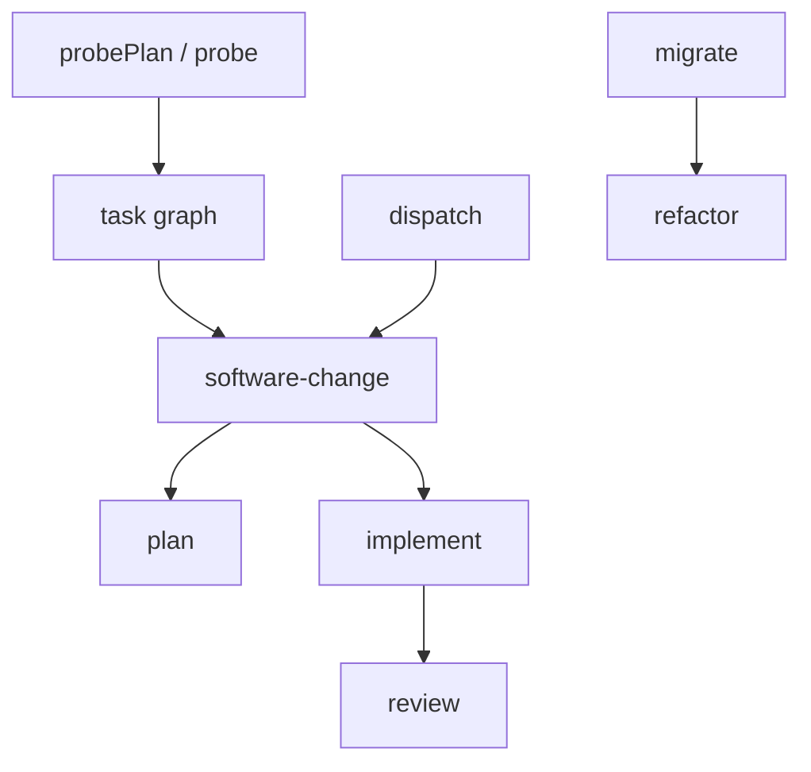

# Architecture

Sigil is a TypeScript workflow system organized around cohesive feature modules inside one package. The public command surface is `migrate`, `refactor`, `probe`, `plan`, `software-change`, `implement`, `review`, `breakdown`, `dispatch`, `validate`, `validate-workflow`, `validate-sigil`, `run-workflow`, `run-sigil`, `setup`, and `discover-env`. `src/cli.ts` is intentionally thin: it selects the command, routes global and per-command help, and maps top-level usage or unhandled errors to process exit codes. It delegates all command-specific work to the command registry in `src/commands/index.ts`.

`src/commands/` is the CLI adapter layer. Command modules parse flags, load files named by flags, call typed workflow functions, format JSON output, and map command results to exit codes. The adapters do not own workflow state transitions. `src/commands/software-change.ts` adapts `plan`, `software-change`, `implement`, and `review`. `src/commands/repository-programs.ts` adapts `probe`, `refactor`, `migrate`, `breakdown`, and `dispatch`. `validation.ts`, `run.ts`, `setup.ts`, and `environment.ts` own their narrower command surfaces.

`src/index.ts` is the TypeScript entrypoint. It exports the authoring surface, shared runtime primitives, workflow callables, contract types, Git and delivery helpers, validation helpers, YAML workflow functions, and the TypeScript sigil runner. Public library calls are plain async functions with typed inputs and typed results. They are not represented as CLI commands internally, and they are not workflow DSL nodes.

Each workflow runs with a `SigilContext` for its target repository. The context owns agent lifecycles, nested workflow calls, parallel operations, configured eval gates, deterministic shell commands, issue recording, and artifact helpers. `ctx.run` passes the active context to a nested workflow, so the parent and child share one artifact root. A caller uses `ctx.fork` when a child operation needs its own artifact namespace and a live operation path mirrored into the parent runtime status.

## Runtime terminology

Sigil is the product and workflow runtime. A workflow coordinates operations and owns a state transition. A TypeScript Sigil is a workflow implemented with the `sigil()` API; a YAML workflow is the declarative surface for a fixed topology. An operation is one bounded prompt, gate, script, artifact write, nested workflow call, or external effect. It is conceptual architecture vocabulary rather than a required first-class runtime object.

An LLM supplies reasoning and generation. An agent runtime supplies tools, permissions, and session continuity. An agent role such as `reviewer` resolves through configuration to an agent binding containing the runtime/provider, model, and reasoning effort. `ctx.agent(...)` creates a live agent session from that binding. See [LLMs, agent runtimes, agents, and workflows](./docs/explanation/llms-agents-and-workflows.md) for the complete glossary.

Users, callers, or configured policy grant authority for repository and external effects. Deterministic code enforces those boundaries and owns persistence, gates, checkpoints, and effect execution. Agents supply bounded judgment inside workflow operations.

## Ownership and dependency direction

Feature modules own workflow behavior under `src/workflows/<feature>/`. A module owns its prompt templates, stage helpers, result shape, state transition, and Mermaid diagram when the workflow is complex enough to need one. Prompt text lives beside the feature module in template files, reached through a small `prompts.ts` binding. Provider/model bindings, eval gate names, shell commands, planner and reviewer roles, branch policy, and batch policy live in `sigil.config.json` and `src/config.ts`. Code bodies name which prompt or configured binding they use; they do not inline prompt text, model names, or shell commands.

Shared modules exist only for contracts and runtime primitives that are genuinely shared. `src/contracts/` owns the backlog and task-graph contracts because multiple workflows read or write those handoff formats. `src/context.ts`, `src/agents.ts`, `src/gate.ts`, `src/git.ts`, `src/paths.ts`, `src/prompts.ts`, `src/recovery/`, `src/verification.ts`, `src/workspace.ts`, `src/yaml/`, and `src/reports/` are root-level primitives because they serve more than one feature boundary. Feature-local helpers stay inside the feature module.

Dependency direction is one-way at workflow boundaries. Command adapters depend on workflow modules. `software-change` composes planning and implementation, and implementation invokes the same review stage used by the standalone review command. `dispatch` may call `softwareChange`, but `software-change` does not depend on dispatch or delivery policy. `migrate` may call `refactor`; `refactor` remains a separate workflow because it owns bounded structural repair and review convergence for one repository slice.

## Composable workflow boundaries

Built-in workflows remain independently callable and compose through typed handoffs:

| Workflow | Owned transition |
| --- | --- |
| `plan` | Change intent to a validated task graph or typed planning failure. |
| `probePlan` | Uncertain change intent to an evidence-backed task graph or typed probe failure through sandboxed experiments. The CLI adapter is `probe`. |
| `implement` | Accepted task graph to implemented, verified, and reviewed branch state. |
| `review` | Existing diff to a reviewed and optionally repaired result. |
| `softwareChange` | Intent or accepted task graph to one verified branch change or a typed stopped result. |
| `breakdown` | Mission to a validated dependency-ordered backlog. |
| `dispatch` | Accepted backlog to checkpointed delivery progress and, when complete, delivered changes. |
| `refactor` | Structural intent to one verified structural transformation. |
| `migrate` | Repository target and backlog to checkpointed repository-wide convergence. |

The routing invariant follows from those ownership boundaries: reuse accepted artifacts and verified state, then invoke the narrowest workflow that owns the unfinished transition.

## Single-change workflow

`softwareChange` is the primary single-change workflow. It composes planning, implementation, verification/review, and evidence construction, then returns a branch and PR body without publishing. It has two entry modes. With normal intent input, it calls `plan`, receives a typed task graph, and passes that graph to `implement`. With `taskFile`, it validates an existing typed task graph and starts at implementation. In both modes the workflow returns combined evidence and does not push, open a pull request, merge, or apply a dispatch policy.

`plan`, `implement`, and `review` remain independently callable stages. They use the same stage modules as the unified workflow, so the command surface and library surface share behavior instead of maintaining duplicate paths. `plan` loads repository context, runs configured planners in parallel, synthesizes or resolves plan outputs when needed, writes a task graph artifact, enriches it, and repairs invalid JSON through the planning prompts. `implement` validates the task graph, orders tasks by dependency, checks out a fresh implementation branch, runs configured gates and repairs around each task, records implementation evidence, invokes review, and returns a PR body. `review` diffs a base ref against HEAD, runs configured correctness reviewers independently, preserves their reports, synthesizes distinct supported findings, optionally fixes actionable findings, and uses the configured review synthesizer to check test diffs for weakened tests.

The task graph is the typed seam between planning and implementation. `src/contracts/task-graph.ts` owns its schema, validation, repo-relative path checks, dependency ordering, cycle detection, and batching. Planning produces the contract; implementation refuses invalid graphs. Acceptance criteria describe observable outcomes. The implementation prompt treats file lists and mechanisms as planning guidance, while the task graph contract remains the authority for task identity, dependency order, acceptance criteria, diagrams, and declared file scope.

## Repository-program workflows

`breakdown`, `dispatch`, `probe`, `refactor`, and `migrate` are separate from `software-change` because each owns a different state transition.

`breakdown` turns a mission into a backlog contract. It runs configured planners in parallel, synthesizes a dependency-ordered backlog, enriches item briefs, validates and repairs backlog JSON, and writes the backlog artifact. The backlog contract lives in `src/contracts/backlog.ts` because `breakdown` produces it and `dispatch` consumes it.

`dispatch` consumes a backlog and applies delivery policy across backlog items. For each deliverable item it calls the public `softwareChange` workflow API from the refreshed remote delivery base. Actionable review findings, including weakened tests, enter a bounded repair loop on the existing item branch. Every repair runs the configured gates. The review configuration controls how many fresh independent reviews may follow repairs and defaults to none. Dispatch then idempotently publishes the item PR, waits for required checks and merge completion, fetches the updated remote delivery base, and verifies that synchronized base before continuing.

Dispatch atomically checkpoints the backlog identity, delivery policy, delivered commits, active item, branch, task graph, and delivery stage beneath the run artifact root. A repeated invocation with the same run context resumes at repair, publish, merge, or base verification without resetting completed branch work or replaying delivered items. A checkpoint cannot be reused with a different backlog or delivery base. `mergeWhenGreen` delivers directly to the configured main branch. `integrationBranch` creates or resumes a named integration branch and accumulates every verified item there. Its final action can stop at one final PR to main or wait for that PR to merge and run a configured production gate. This keeps delivery policy out of `software-change` while allowing dispatch to reuse the single-change implementation path.

`probe` is a planning aid that owns sandboxed investigation before implementation. It clones a sandbox outside the target worktree, runs bounded probe commands there, preserves the target tree, writes evidence and findings artifacts, and produces the same typed task graph contract that `implement` consumes.

`refactor` owns one bounded, behavior-preserving structural change. It requires a clean target tree, establishes baseline gates, analyzes structure and risk, applies planned slices with protected-path checks, runs configured gates with bounded repair, then converges independent structure and behavior reviews. Focus paths are advisory starting points, not allowlists; protected paths are hard boundaries.

`migrate` owns repository migration checkpoints. It reads a caller-owned target and backlog from a durable external run directory, reconciles resumable checkpoint state, and runs dependency-ordered refactor items in item-owned attempt directories. The CLI rejects migration repositories, inputs, and run directories beneath operating-system temporary storage. A failed attempt preserves its diff and evidence before restoring the dedicated worktree to the preceding verified checkpoint. A verified attempt writes a pending checkpoint journal, commits the item, records the completed checkpoint, and advances state. After item completion, repository-wide build, test, architecture review, and behavior review converge through local repair histories, protected-path enforcement, and checkpointed final repairs.

## Run data, artifacts, and repository boundaries

Every top-level workflow invocation owns one artifact root beneath the repository's ignored `.sigil/runs/` directory. Nested workflows invoked through `ctx.run` inherit the same context and artifact root. Explicitly forked operations create child namespaces beneath that root. Dispatch gives each backlog item its own `dispatch/<item>/` namespace and runs `softwareChange` inside that item context. Explicit ephemeral persistence permits disposable temporary storage. Context-owned artifact writes go through `ctx.artifacts.path(name)`, which applies the shared path escape check. Workflows that receive a caller-owned run directory, such as `migrate`, keep mutable state, events, snapshots, and final review artifacts beneath that directory.

A workflow result is the typed value returned to its caller. An artifact is a named file output or piece of evidence owned by the workflow context. Checkpoint state is mutable resumable progress owned by workflows such as dispatch and migrate. Context `status.json` records the latest observed workflow event. A detached `run-sigil` worker adds launcher status, logs, result, and error files around the workflow run. These files have different ownership and should not be treated as interchangeable.

A workflow edits tracked project files only when that workflow explicitly owns repository edits. `plan`, `breakdown`, and normal artifact writes produce ignored run artifacts. `probe` may mutate its sandbox but must preserve the target tree. `implement` owns target edits for task execution, review fixes, and gate repairs on its implementation branch. `refactor` owns target edits for its bounded slice and review repairs. `migrate` owns target edits by delegating each backlog item to `refactor` and by committing verified item and final repair checkpoints.

Configured context is repo-relative and validated before rendering. Context entries marked `update: false` are read-only orientation unless a task explicitly declares them as outputs. Entries marked `update: true` may be updated in place only when the implementation makes their statements false. That rule keeps context files synchronized without turning them into changelogs.

## Configuration, agents, and gates

`sigil.config.json` is the single configuration source. `loadConfig()` searches upward from the target repo, validates the config shape, and rejects references to unknown agents. The config owns agent routing, eval commands, an optional workspace bootstrap command, context files, planner and synthesizer names, implement coder, batch size, repair limit, per-operation timeout, branch prefix, base branch, optional test report settings, and review panel and synthesizer. The default planner and review panels use Sol, Terra, and Luna at low effort, synthesize with Sol at medium effort, and implement with Sol at low effort. The default per-operation timeout is ninety minutes and resets for each retry attempt. Implementation and refactor workflows run the configured workspace bootstrap after checkout and before baseline gates, fail on a nonzero exit, and require it to leave tracked repository files unchanged.

Agents are provider/model bindings. `agent(name | binding, { cwd })` and `ctx.agent(name | binding)` accept either a configured name or an inline binding, then construct a common `SigilAgent` interface with text and schema prompting. Configured bindings default to medium reasoning effort. `discover-env` reports configured bindings and available local providers; it does not change workflow state.

Gates are named shell commands from config. `evalGate(name)` resolves a configured command, skips absent gates, and runs present commands under the target repo. Implementation uses build/test gates around each task and stronger configured gates at the end. Refactor and migrate use deterministic gates as workflow checks, but repository deterministic gates are not authored as model-generated plan steps.

## Diagrams and documentation expectations

Complex workflows keep Mermaid diagrams checked in beside their feature modules. The diagrams are reference documentation for stage ownership, state transitions, artifact boundaries, gate boundaries, failure paths, and intended parallelism. They should align with the code at the module boundary: `software-change` shows planning and implementation stages plus the no-publish delivery boundary; `breakdown` shows planner fan-out, synthesis, repair, and dependency ordering; `dispatch` shows backlog ordering, per-item `softwareChange` calls, dispatch-owned delivery, and base verification; `probe` shows sandboxed command execution and typed handoff; `refactor` shows slice repair and review convergence; `migrate` shows external checkpoint state, item execution, and final convergence.

Durable architecture docs describe current ownership and state transitions. They should not explain how the layout changed, refer to removed source locations, imply a multi-package application layout, add compatibility layers, or duplicate feature sources. When the code and documentation diverge, update the feature module, its prompt templates, its contract ownership, and its diagram together so the public command surface, library surface, and operator reference describe the same system.
