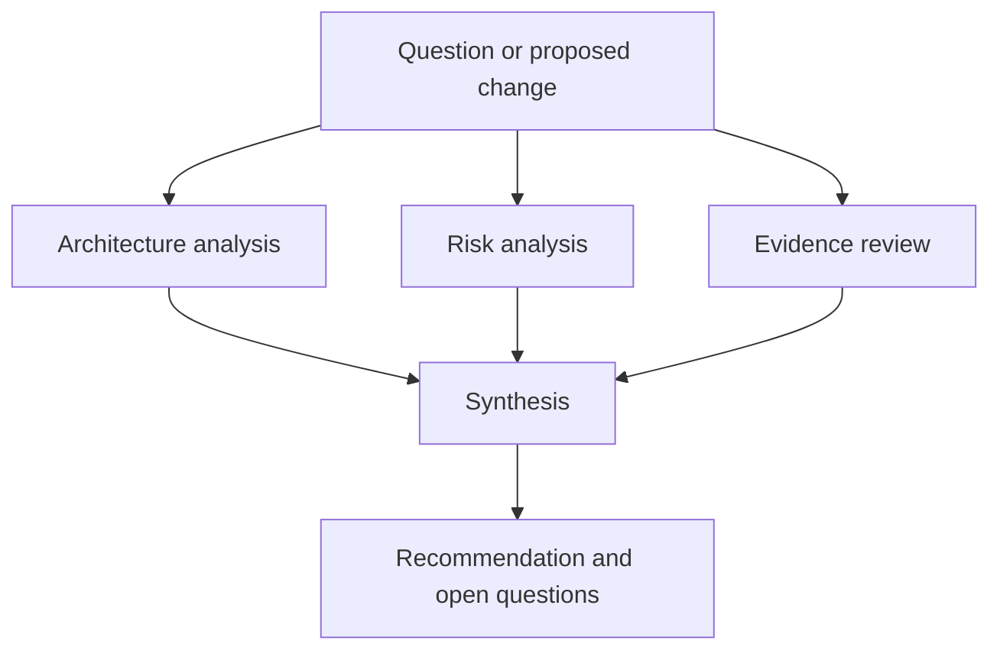
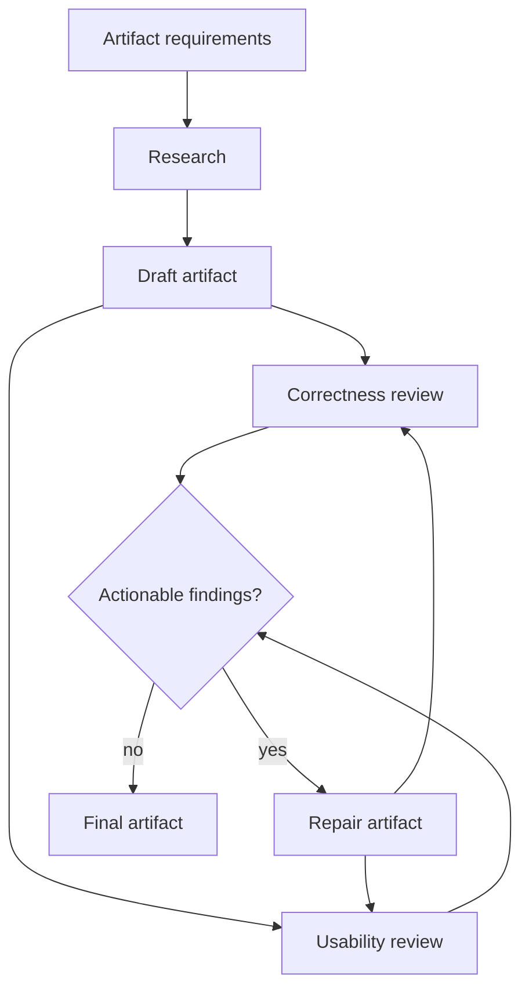
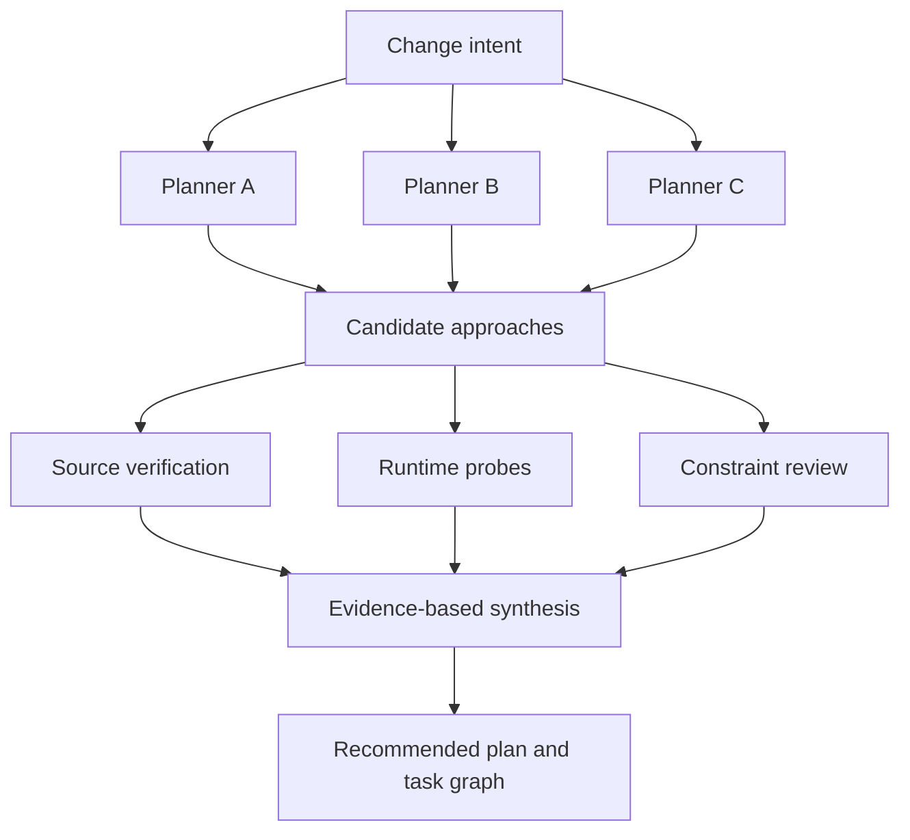
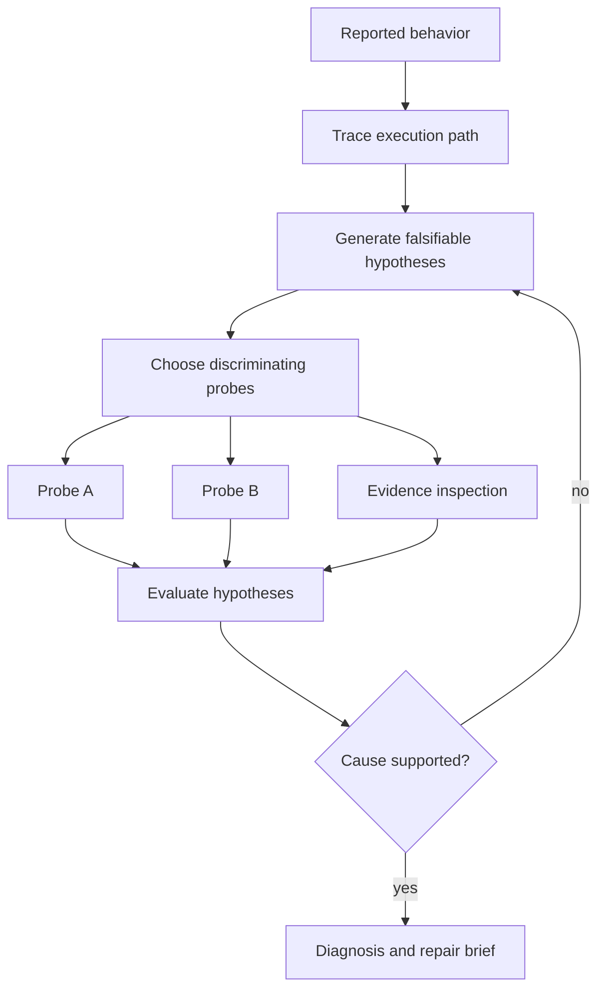
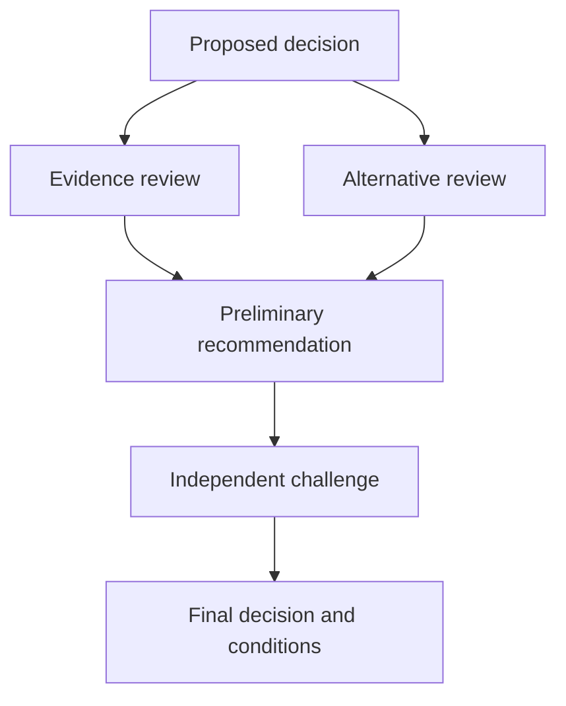
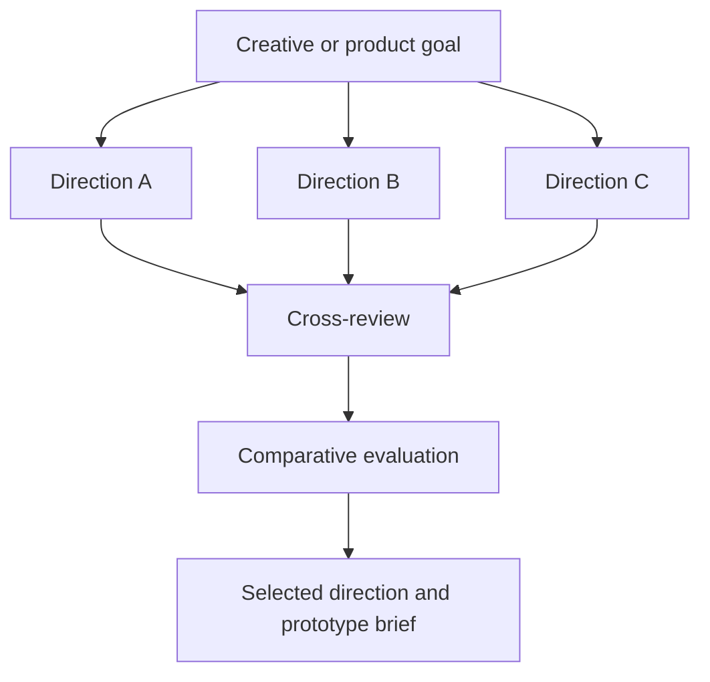
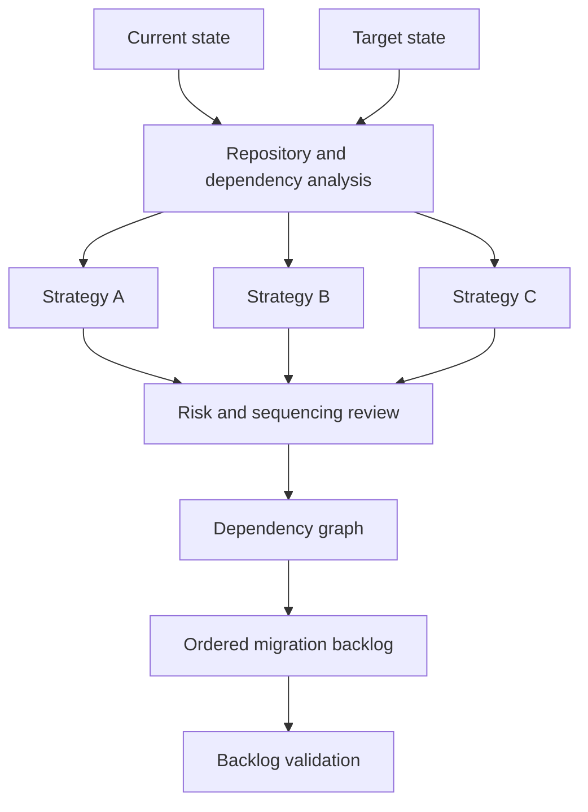
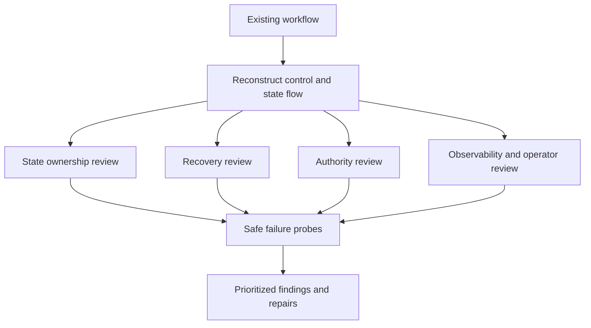
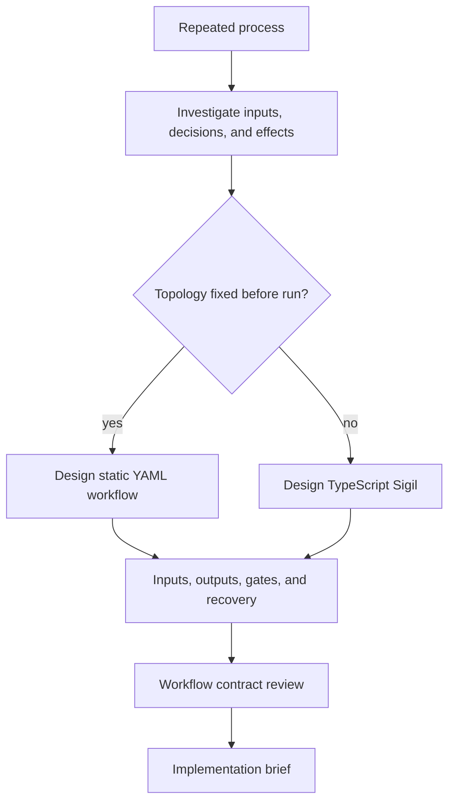

# Ephemeral Sigil pattern catalog

An ephemeral Sigil is a repository-specific TypeScript workflow created for one substantial request. The patterns below describe reusable orchestration shapes, not fixed built-in commands. Start with the diagram, choose the pattern that matches the work, then use the example prompt to ask an assistant to create and run an appropriate Sigil.

Sigil already owns durable run storage, validation, detached execution, status, logs, and result inspection. A user prompt should describe the work and its boundaries rather than repeat those mechanics.

Use a built-in workflow when it already fits. Use a normal assistant answer for a short investigation or simple edit. A custom Sigil earns its cost when agent roles, parallel work, artifacts, gates, branching, or repair behavior materially improve the result.

## Parallel analysis and synthesis

### Use when

Use this pattern when a decision benefits from independent perspectives, domain specialization, or visible disagreement. Typical uses include architecture proposals, product workflow design, dependency evaluation, and comparative research.

### Avoid when

Avoid it when every branch would read the same small source and reach the same conclusion, or when one sequential investigation would be clearer.

### How it works

Independent agents receive distinct questions without sharing context. Their reports become explicit artifacts or typed values. A fresh agent compares the reports, preserves useful disagreement, and produces one recommendation.

### Example prompt

> Create and run an ephemeral Sigil to develop an architecture proposal for **[QUESTION]**. Have independent agents investigate the current implementation, state ownership, alternative designs, and operational risks. Synthesize a recommended design, rejected alternatives, unresolved questions, and implementation brief. Preserve meaningful disagreement and do not implement the proposal.

### Common variations

- Security, reliability, and data-model reviews
- Build-versus-buy decisions
- Repository orientation
- API design comparisons

## Draft, review, and repair

### Use when

Use this pattern for documentation, specifications, runbooks, prompts, plans, and other artifacts that benefit from independent criticism and bounded revision.

### Avoid when

Avoid it when the artifact is trivial, the review criteria are undefined, or repeated review cannot produce a meaningful stopping condition.

### How it works

One agent researches and drafts. Independent reviewers return structured findings. Actionable findings go back to the drafting role for repair. Every repair receives fresh review until no actionable findings remain or a stable finding exhausts its repair budget.

### Example prompt

> Create and run an ephemeral Sigil that produces **[ARTIFACT]**. Use one agent to investigate source material, another to draft, and independent reviewers to evaluate correctness, completeness, usability, and consistency with repository behavior. Route actionable findings back for bounded repair and require fresh review after each repair. Do not write to tracked project files.

### Common variations

- Documentation verification and correction
- Prompt development
- Design specification review
- Release runbook creation

## Proposal and independent verification

### Use when

Use this pattern when plausible plans depend on contested facts about source, dependencies, configuration, or runtime behavior.

### Avoid when

Avoid it when the work is already understood and can be expressed directly as a task graph.

### How it works

Planning and verification are separate responsibilities. Planners propose independently. Verification agents test concrete claims without defending a preferred plan. The synthesizer retains only approaches supported by evidence.

### Example prompt

> Create and run an ephemeral Sigil to plan **[CHANGE]**. Have planning agents independently propose approaches. Then have separate agents test their claims against current source, configuration, dependency behavior, and safe runtime probes. Produce a recommended design, rejected alternatives, affected boundaries, acceptance criteria, risks, open questions, and an implementation-ready task graph. Do not implement it.

### Common variations

- Documentation claims verified against behavior
- Technology selection
- Existing plan review
- Refactor design

## Hypothesis testing

### Use when

Use this pattern for subtle failures, inconsistent runtime behavior, performance problems, and deployment discrepancies where several causes are plausible.

### Avoid when

Avoid it when the failure and repair are already demonstrated by direct evidence.

### How it works

An initial trace grounds the investigation. Agents produce falsifiable hypotheses and probes chosen to distinguish them. Evidence updates or eliminates hypotheses. The loop stops with a supported diagnosis or an explicit account of unresolved uncertainty.

### Example prompt

> Create and run an ephemeral Sigil to investigate **[FAILURE]**. Trace the execution path, develop falsifiable root-cause hypotheses, and use repository evidence and safe probes to distinguish them. Produce the most likely cause, competing hypotheses, affected paths, second-order effects, the smallest correct repair, and tests that would prove it. Do not modify the repository.

### Common variations

- Deployment failure analysis
- Performance investigation
- Dependency behavior investigation
- Concurrency defect analysis

## Adversarial decision review

### Use when

Use this pattern when a consequential decision could be weakened by premature consensus, hidden assumptions, or an attractive but fragile narrative.

### Avoid when

Avoid it for reversible low-cost choices or when the decision can be settled by one deterministic fact.

### How it works

Independent agents review evidence and alternatives. A synthesizer produces a preliminary recommendation. A fresh adversarial reviewer argues the strongest evidence-based case against it. Final synthesis must address rather than merely append the challenge.

### Example prompt

> Create and run an ephemeral Sigil to evaluate this decision: **[DECISION]**. Have independent agents examine evidence, assumptions, alternatives, implementation consequences, and failure scenarios. Ask a fresh agent to argue the strongest case against the preliminary recommendation. Produce a final decision, rationale, rejected alternatives, risks, open questions, and evidence that would justify revisiting it.

### Common variations

- Architecture decision records
- Vendor selection
- Release approval
- Product investment decisions

## Divergent generation and selection

### Use when

Use this pattern when the value comes from materially different possibilities rather than one optimized answer. Typical uses include product concepts, naming systems, user workflows, and creative direction.

### Avoid when

Avoid it when constraints already determine the solution or when agents are likely to produce superficial variations.

### How it works

Independent agents are explicitly asked for different approaches. Cross-review exposes weaknesses and reusable elements. A comparative reviewer evaluates fit and distinctiveness before synthesis selects a direction.

### Example prompt

> Create and run an ephemeral Sigil to develop options for **[GOAL]**. Have independent agents produce materially different approaches rather than minor variations. Use cross-review to evaluate distinctiveness, fit, feasibility, clarity, and likely user response. Produce the strongest direction, useful elements from rejected options, remaining uncertainties, and a prototype brief. Do not implement it.

### Common variations

- Product concept exploration
- Naming and messaging systems
- Information architecture
- Interaction design alternatives

## Dependency-ordered migration planning

### Use when

Use this pattern when a target architecture must be reached through several dependent, independently verifiable changes.

### Avoid when

Avoid it when one bounded refactor or one pull request can accomplish the change safely.

### How it works

Agents investigate the current and target states, propose competing strategies, and review sequencing risks. Synthesis converts the selected design into a dependency graph and validates that each backlog item has a coherent outcome and verification boundary.

### Example prompt

> Create and run an ephemeral Sigil to design a migration from **[CURRENT STATE]** to **[TARGET STATE]**. Investigate repository-wide dependencies, state ownership, sequencing constraints, rollback needs, and verification gates. Compare migration strategies and produce a target design, dependency-ordered backlog, checkpoint strategy, risks, and completion criteria. Do not execute the migration.

### Common variations

- Framework migration
- Data ownership migration
- Module-boundary redesign
- Service extraction

## Multi-dimensional workflow audit

### Use when

Use this pattern to assess automation, delivery pipelines, agent workflows, and other systems whose failures emerge from interactions between control flow, state, recovery, authority, and operations.

### Avoid when

Avoid it for a narrow local defect with a known execution path.

### How it works

A lead agent first reconstructs the workflow so parallel reviewers share the same object. Reviewers inspect distinct system properties. Safe probes test important failure paths. Synthesis prioritizes concrete scenarios rather than collecting generic concerns.

### Example prompt

> Create and run an ephemeral Sigil to audit **[WORKFLOW]**. Trace its control flow and persisted state, then have independent agents examine correctness, recovery, idempotency, authority boundaries, observability, and operator experience. Test important failure paths safely. Produce prioritized findings, recommended changes, and verification criteria. Do not modify or trigger external effects.

### Common variations

- CI and deployment audits
- Agent workflow reliability reviews
- Security-sensitive automation reviews
- Background job processing reviews

## Conditional workflow selection

### Use when

Use this pattern when the first design question is which automation surface fits the process. It is useful for repeated operational, research, content, and engineering workflows.

### Avoid when

Avoid it when a built-in Sigil already implements the required workflow or when the task should remain a human procedure.

### How it works

The workflow investigates process boundaries before choosing an implementation surface. Fixed stages and references favor static YAML. Runtime discovery, iteration, and dynamic branching favor TypeScript. Both paths converge on explicit contracts, gates, external effects, and recovery behavior.

### Example prompt

> Create and run an ephemeral Sigil to design automation for **[PROCESS]**. Investigate its inputs, outputs, decision points, external effects, failure handling, and human approval boundaries. Decide whether static YAML, a TypeScript Sigil, or an existing built-in workflow is the right surface. Produce the recommended workflow, contracts, stages, agent roles, gates, recovery behavior, and implementation brief.

### Common variations

- Research automation
- Content production pipelines
- Operational review workflows
- Repository maintenance routines

## From pattern to workflow

The assistant creating the ephemeral Sigil should adapt the pattern rather than translate the diagram mechanically. Agent roles should come from repository configuration when practical. Prompts should be specific to the request. Artifacts should exist only when they carry evidence or state between steps. Deterministic checks should decide facts that code can decide. External effects and protected resources should be explicit.

A useful user prompt usually needs only four things:

1. The workflow pattern or desired shape
2. The concrete repository question or outcome
3. Boundaries such as whether edits, publication, or deployment are allowed
4. Required outputs or decision criteria

Execution mechanics belong to Sigil and the authoring workflow.
