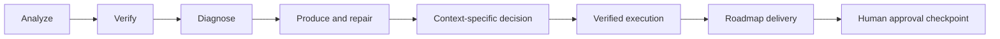
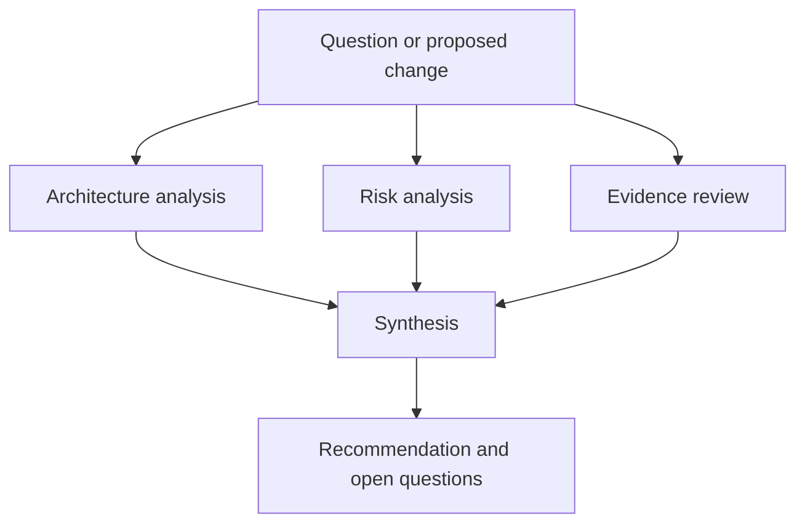
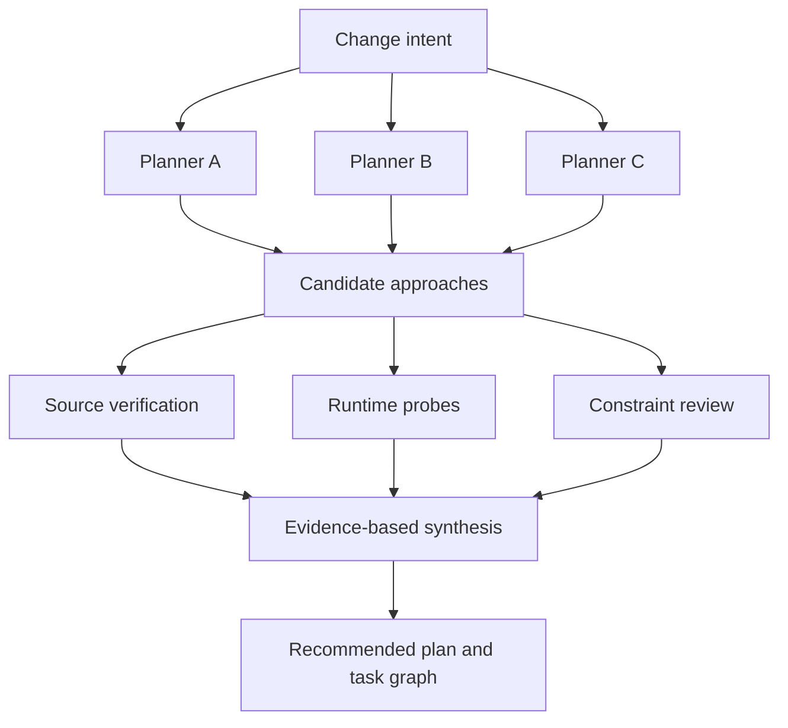
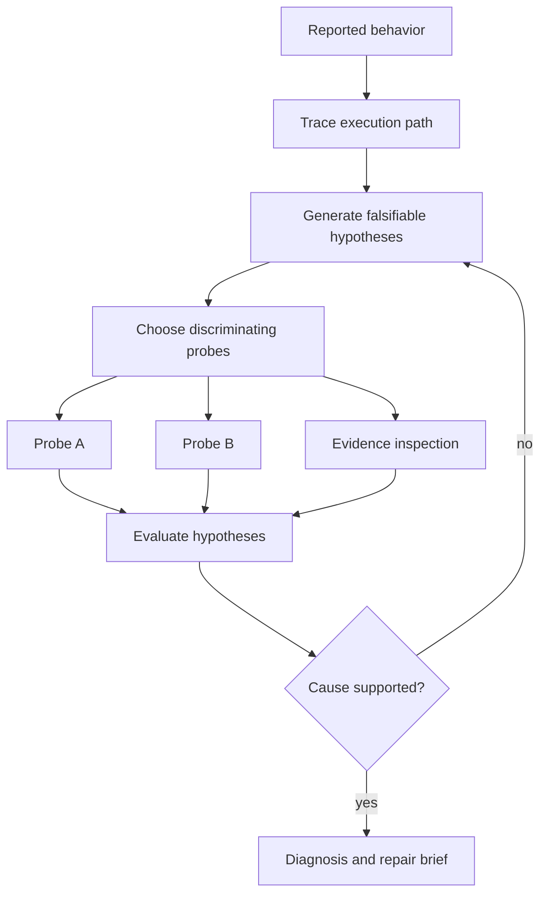
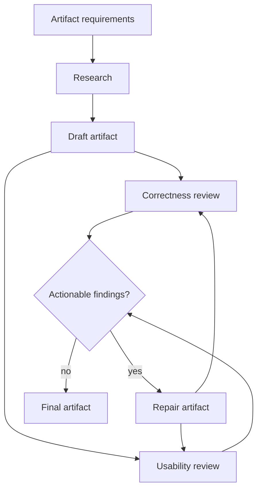
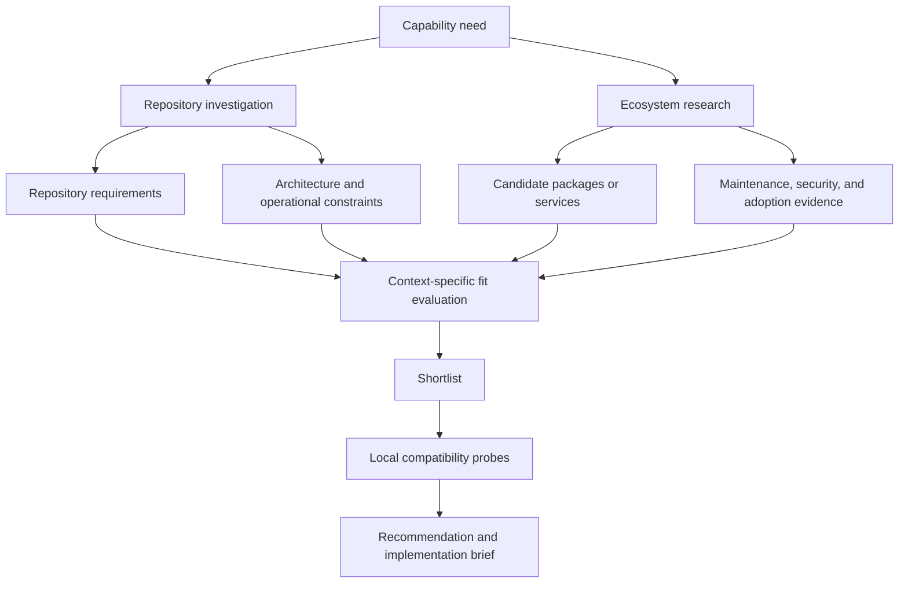
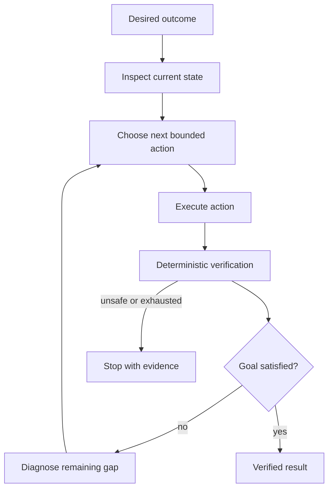
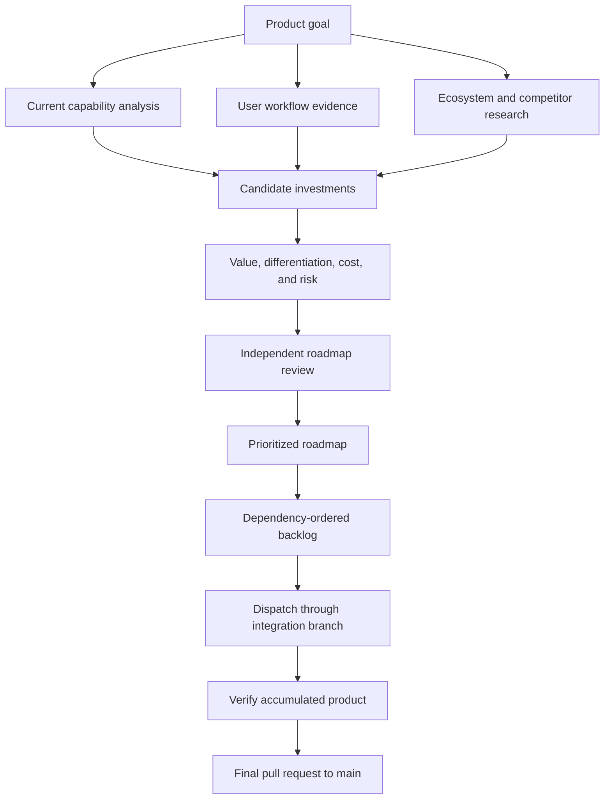
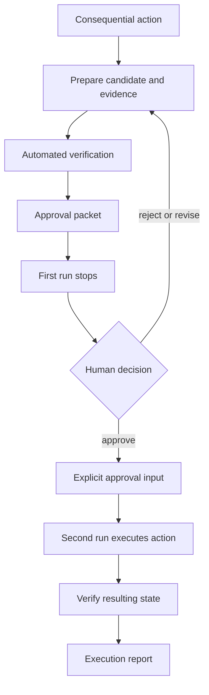

# Workflow pattern catalog

These patterns describe reusable orchestration shapes, not fixed built-in commands. They apply to temporary and maintained custom workflows. Start with the diagram, choose the shape that matches the work, then adapt it to the repository and authority boundary.

Sigil owns run storage, validation, detached TypeScript workflow execution, status, logs, and result inspection. A user prompt should describe the work and its boundaries rather than repeat those mechanics.

Use a built-in workflow when it already fits. Use a normal assistant answer for a short investigation or simple edit. A custom workflow earns its cost when agent roles, parallel work, artifacts, gates, branching, or repair behavior materially improve the result.

## Choose a pattern

| Pattern | Use it to | Example |
| --- | --- | --- |
| [Parallel analysis and synthesis](#parallel-analysis-and-synthesis) | Combine independent perspectives without hiding disagreement. | Architecture decision |
| [Proposal and independent verification](#proposal-and-independent-verification) | Separate idea generation from factual verification. | Technical plan |
| [Hypothesis testing](#hypothesis-testing) | Let evidence determine the next investigation step. | Failure diagnosis |
| [Draft, review, and repair](#draft-review-and-repair) | Produce an artifact and repair independently reported defects. | Documentation or specification |
| [Repository and ecosystem fit](#repository-and-ecosystem-fit) | Join local constraints with current external options. | Package selection |
| [Goal-directed execution with verification](#goal-directed-execution-with-verification) | Act, verify, adapt, and stop at protected boundaries. | Repository repair |
| [Research-backed roadmap and dispatch](#research-backed-roadmap-and-dispatch) | Convert evidence into an executable backlog and deliver it. | Product development program |
| [Human approval checkpoint](#human-approval-checkpoint) | Separate preparation from an action that requires human authority. | Production deployment |

These patterns form a progression from analysis to verified execution:



## Parallel analysis and synthesis



### Use when

Use this pattern when a decision benefits from independent perspectives, domain specialization, or visible disagreement. Typical uses include architecture proposals, product workflow design, security reviews, and comparative analysis.

### Avoid when

Avoid it when every branch would read the same small source and reach the same conclusion, or when one sequential investigation would be clearer.

### Example prompt

> Create and run a temporary TypeScript Sigil to develop an architecture proposal for **[QUESTION]**. Have independent agents investigate the current implementation, state ownership, alternative designs, and operational risks. Synthesize a recommended design, rejected alternatives, unresolved questions, and implementation brief. Preserve meaningful disagreement and do not implement the proposal.

### Common applications

- Multi-dimensional workflow audits
- Reliability, security, and data-model reviews
- Build-versus-buy decisions
- Divergent creative generation followed by selection

## Proposal and independent verification



### Use when

Use this pattern when plausible plans depend on contested facts about source, dependencies, configuration, or runtime behavior.

### Avoid when

Avoid it when the work is already understood and can be expressed directly as a task graph.

### Example prompt

> Create and run a temporary TypeScript Sigil to plan **[CHANGE]**. Have planning agents independently propose approaches. Then have separate agents test their claims against current source, configuration, dependency behavior, and safe runtime probes. Produce a recommended design, rejected alternatives, affected boundaries, acceptance criteria, risks, open questions, and an implementation-ready task graph. Do not implement it.

### Common applications

- Documentation claims verified against behavior
- Technology selection
- Adversarial decision review
- Existing plan review

## Hypothesis testing



### Use when

Use this pattern for subtle failures, inconsistent runtime behavior, performance problems, and deployment discrepancies where several causes are plausible.

### Avoid when

Avoid it when the failure and repair are already demonstrated by direct evidence.

### Example prompt

> Create and run a temporary TypeScript Sigil to investigate **[FAILURE]**. Trace the execution path, develop falsifiable root-cause hypotheses, and use repository evidence and safe probes to distinguish them. Produce the most likely cause, competing hypotheses, affected paths, second-order effects, the smallest correct repair, and tests that would prove it. Do not modify the repository.

### Common applications

- Deployment failure analysis
- Performance investigation
- Dependency behavior investigation
- Concurrency defect analysis

## Draft, review, and repair



### Use when

Use this pattern for documentation, specifications, runbooks, prompts, plans, and other artifacts that benefit from independent criticism and bounded revision.

### Avoid when

Avoid it when the artifact is trivial, review criteria are undefined, or repeated review cannot produce a meaningful stopping condition.

### Example prompt

> Create and run a temporary TypeScript Sigil that produces **[ARTIFACT]**. Use one agent to investigate source material, another to draft, and independent reviewers to evaluate correctness, completeness, usability, and consistency with repository behavior. Route actionable findings back for bounded repair and require fresh review after each repair. Do not write to tracked project files.

### Common applications

- Documentation verification and correction
- Prompt development
- Design specification review
- Release runbook creation

## Repository and ecosystem fit



### Use when

Use this pattern when an external package, service, platform, model, or tool must fit the actual needs and constraints of a specific repository.

### Avoid when

Avoid it when the repository already standardizes the choice, the decision is inconsequential, or current external evidence would not change the result.

### Example prompt

> Create and run a temporary TypeScript Sigil to determine the best package or service for **[CAPABILITY]** in this repository. Derive concrete requirements and constraints from the current codebase. Independently research the current ecosystem using primary sources. Evaluate candidates for repository-specific fit, maintenance, security, integration cost, failure behavior, and exit strategy. Run safe local compatibility probes for the strongest candidates when useful. Produce a recommendation, comparison table, rejected alternatives, and implementation brief. Do not change dependencies.

### Common applications

- npm package selection
- Database, queue, or hosting selection
- Framework and SDK evaluation
- External release impact analysis

## Goal-directed execution with verification



### Use when

Use this pattern when the desired outcome is clear but the correct sequence of actions depends on what each action reveals. Deterministic checks can verify progress while agents choose bounded repairs.

### Avoid when

Avoid it when actions are destructive, irreversible, or insufficiently bounded, or when a fixed implementation plan already describes the work correctly.

### Example prompt

> Create and run a temporary TypeScript Sigil that achieves **[OUTCOME]** within **[BOUNDARIES]**. Inspect the current state, choose one bounded action, execute it, and verify the resulting state. Continue only when deterministic checks show progress. Preserve evidence for failed actions, use bounded repair, and stop before crossing protected paths or external-effect boundaries.

### Common applications

- Repository and environment repair
- Configuration reconciliation
- Dependency modernization
- Test-suite stabilization

## Research-backed roadmap and dispatch



### Use when

Use this pattern when product decisions should be grounded in repository capabilities, user needs, and current external evidence, then translated into independently deliverable work.

### Avoid when

Avoid it when the requested outcome is already decided, the work fits one pull request, or research evidence should not authorize implementation without a separate decision.

### Example prompt

> Create and run a custom workflow that develops and executes a research-backed roadmap for **[PRODUCT GOAL]**. Build a current capability model from the repository, investigate user workflows and current external alternatives, and generate candidate product investments. Evaluate user value, differentiation, evidence quality, implementation cost, operational risk, reversibility, and dependencies. Use independent reviewers to challenge weak claims and unnecessary scope. Produce a dependency-ordered backlog, dispatch it through an integration branch, and leave the final pull request to main open for review.

### Common applications

- Product capability programs
- Platform modernization roadmaps
- Competitive-response planning
- Research-to-delivery automation

## Human approval checkpoint



### Use when

Use this pattern when automation can prepare and verify a consequential action but a person owns the authority to proceed. Typical boundaries include production changes, destructive operations, public communication, access grants, and financial actions.

### Avoid when

Avoid it when deterministic policy already authorizes the action, when the action is low-risk and reversible, or when a person cannot meaningfully evaluate the approval packet.

### Example prompt

> Create and run a temporary TypeScript Sigil that prepares **[CONSEQUENTIAL ACTION]** for human approval. Produce the exact proposed action, evidence, verification results, risks, rollback plan, and unresolved issues, then stop without executing it. If I later approve it explicitly, run a separate execution Sigil that consumes the approved action, verifies that its assumptions are still current, performs only the authorized effects, and confirms the resulting state.

### Common applications

- Production deployment
- Destructive data migration
- Permission or access changes
- Public release or communication

## From pattern to workflow

The assistant creating the custom workflow should adapt the pattern rather than translate the diagram mechanically. Agent roles should come from repository configuration when practical. Prompts should be specific to the request. Artifacts should exist only when they carry evidence or state between steps. Deterministic checks should decide facts that code can decide. External effects and protected resources should be explicit.

A useful user prompt usually needs only four things:

1. The workflow pattern or desired shape
2. The concrete repository question or outcome
3. Boundaries such as whether edits, publication, or deployment are allowed
4. Required outputs or decision criteria

Execution mechanics belong to Sigil and the authoring workflow.

## Building blocks

Use these smaller shapes inside the larger patterns above. They describe local control-flow choices rather than complete product workflows.

### Sequential deep investigation

Reuse one agent over several prompt steps so it can build context, follow leads, and revise its view.

```text
question
  -> explore
  -> hypotheses
  -> verify or falsify
  -> deepen
  -> report or plan
```

Use this for unfamiliar systems, subtle bugs, comprehensive plans, and complex explanations. It is the right shape when depth matters more than independent viewpoints. If independence matters, use separate agents instead.

### Broad exploration followed by deep analysis

Use several smaller or faster agents to map the space, then give their findings to a stronger agent for deeper analysis.

```text
question
  -> broad exploration
  -> lead map
  -> deep analysis
  -> report or plan
```

Use this when the relevant surfaces are unknown, such as a large repo, ambiguous request, or incident investigation. The broad pass maps leads; the deep pass verifies and decides.

### Classify and route

Ask for a controlled classification, then let deterministic code choose the next path.

```text
input
  -> classify
  -> route
  -> specialized workflow
```

Use this for issue triage, inbox processing, support flows, and deciding whether to plan, decompose, research, answer, or stop. The categories should be few, clear, and tied to different actions.

### Evidence bundle then execution

First turn messy input into a grounded bundle of user intent, verified facts, assumptions, constraints, and open questions. Then feed that bundle into a planning, research, advice, or implementation workflow.

```text
messy input
  -> requirements extraction
  -> verify facts
  -> ask targeted questions
  -> bundle
  -> downstream workflow
```

Use this when the request is important but still evolving. Preserve the user's words separately from interpreted requirements, and ask only questions that change the next action or safety.

### Gate and repair

Run a deterministic check. If it fails, ask an agent to repair the work, then run the check again.

```text
artifact or code
  -> deterministic gate
  -> repair if red
  -> rerun gate
  -> pass or issue
```

Use this for code, generated JSON, workflow files, structured docs, and other artifacts with clear validation. The gate owns pass/fail. The agent owns repair.
